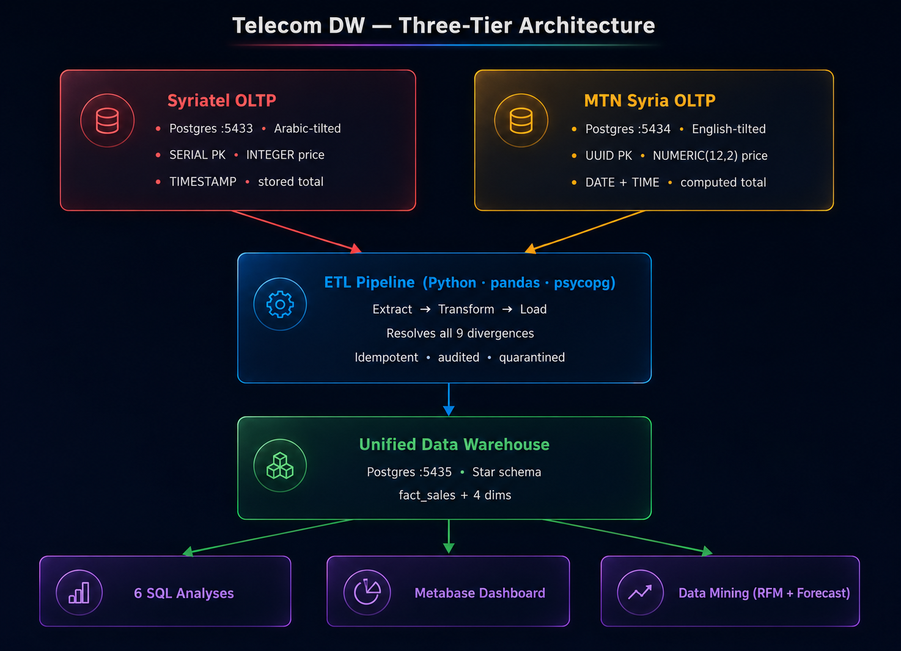
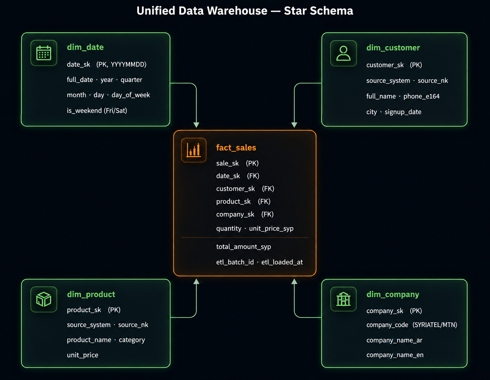
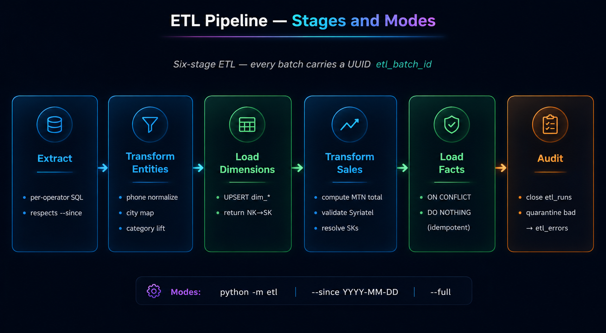

# Telecom DW — Unified Data Warehouse for Two Syrian Telecom Operators

## Table of Contents

1. [Scenario](#1-scenario)
2. [Team](#2-team)
3. [Architecture](#3-architecture)
4. [Quickstart](#4-quickstart)
5. [Ports](#5-ports)
6. [The Divergence Rule — 9 dimensions](#6-the-divergence-rule--9-dimensions)
7. [OLTP Designs](#7-oltp-designs)
8. [Data Warehouse — Star Schema](#8-data-warehouse--star-schema)
9. [ETL Pipeline](#9-etl-pipeline)
10. [Scheduling](#10-scheduling)
11. [Six Required Analyses](#11-six-required-analyses)
12. [Data Mining](#12-data-mining)
13. [Ministry Recommendations](#13-ministry-recommendations)
14. [Repo Layout](#14-repo-layout)
15. [Definition of Done](#15-definition-of-done)

---

## 1. Scenario

Two Syrian telecom operators — **Syriatel** and **MTN Syria** — each run independent OLTP sales systems. The two systems differ in schema, naming, language, and data formats. The Ministry of Communications needs a **unified data warehouse** that consolidates both into a single schema enabling cross-operator analysis and decision support.

This repository delivers:

- Two **divergent OLTPs** modelling that real-world mess (Postgres, port 5433/5434).
- A **unified star-schema** data warehouse (Postgres, port 5435).
- A **Python ETL** pipeline that reconciles all the divergences, idempotently.
- Weekly **pg_cron + LISTEN/NOTIFY** scheduling.
- **Six required analytical queries** answering Ministry questions.
- A **Plotly Dash** dashboard surfacing the same six analyses.
- A **data-mining layer** — RFM segmentation + Holt-Winters monthly forecast.

System size: ~1000 customers and ~10,000 orders per operator over a 12-month window. The resulting DW contains ~20,000 rows in `fact_sales`, ~2000 unique customers, 30 products, and 17 Syrian cities.

## 2. Team

| Member | Handle | Role |
|---|---|---|
| Ibrahim (lead) | `ibrah5em` | Architecture, ETL, DW, data mining, infrastructure |
| Luf8y | `luf8y` | Supporting contributor — OLTP, analytics queries, dashboard UI |

## 3. Architecture

A three-tier system:



- **Tier 1 — Sources:** two independent Postgres OLTPs.
- **Tier 2 — ETL:** Python package using `pandas` + `psycopg`. Stages: Extract → Transform (resolves all 9 divergences) → Load (idempotent). Each batch is recorded in `etl_runs`; bad rows are quarantined in `etl_errors`.
- **Tier 3 — Warehouse & Analytics:** unified star schema feeding six SQL analyses, the data-mining outputs, and a Plotly Dash dashboard on port 3000.

## 4. Quickstart

Requires Docker, Docker Compose, Python 3.11+, and `pip`.

```bash
# 1. Configure
cp .env.example .env

# 2. Bring up all services (Postgres instances, ETL listener, Dashboard)
make up
make wait-healthy

# 3. Install Python deps
pip install -r requirements.txt

# 4. Seed both OLTPs with realistic data
make seed

# 5. Verify the OLTPs differ along all 9 required dimensions
make verify

# 6. Run the ETL into the DW
make etl-full

# 7. Run the six analyses
make analytics

# 8. Open the dashboard
make dashboard       # http://localhost:3000
```

## 5. Ports

| Service | Port |
|---|---|
| Syriatel OLTP | 5433 |
| MTN OLTP | 5434 |
| Unified DW | 5435 |
| Dashboard | 3000 |

## 6. The Divergence Rule — 9 dimensions

The brief explicitly requires the two OLTPs to differ. The ETL must resolve every row of this table; this is the heart of the project.

| Dimension | Syriatel | MTN Syria | ETL resolution |
|---|---|---|---|
| 1. Table naming | `customers`, `products`, `orders` | `clients`, `items`, `transactions` | Conformed names in DW (`dim_customer`, `dim_product`, `fact_sales`) |
| 2. Primary key | `SERIAL` integer | `UUID` | Surrogate `*_sk` in every DW dim/fact |
| 3. City storage | Arabic (`دمشق`, `حلب`) | English (`Damascus`, `Aleppo`) | Both map to canonical English via `data/syrian_cities.csv` |
| 4. Phone format | E.164 (`+963944123456`) | National (`0944123456`) | Normalized to `+9639XXXXXXXX` in `dim_customer.phone_e164` |
| 5. Price type | `INTEGER` (whole SYP) | `NUMERIC(12,2)` | DW uses `NUMERIC(14,2)`; Syriatel ints are promoted |
| 6. Order total | **Stored** column `total_price` | **Not stored** | MTN: computed as `quantity * price`. Syriatel: validated against re-computed value; mismatches go to `etl_errors`. |
| 7. Date storage | Single `TIMESTAMP` | Separate `DATE` + `TIME` | Both reduce to a `date_sk` (`YYYYMMDD` int) joining `dim_date` |
| 8. Product category | `Internet` / `Voice` / `Bundle` (Title) | `INTERNET` / `VOICE` / `BUNDLE` (UPPER) | Normalized to UPPER in `dim_product.category` |
| 9. Product names | Arabic ("باقة 5GB") | English ("5GB Internet Bundle") | `dim_product.product_name` stores the canonical English form via `data/product_catalog.csv` |

Verifier: `make verify` (or `python scripts/verify_divergence.py`) introspects both schemas and confirms every dimension. It exits non-zero if any is missing.

## 7. OLTP Designs

### Syriatel OLTP — Arabic-tilted

Four tables. `SERIAL` PKs. Single `TIMESTAMP`. Prices as `INTEGER`. Stored `total_price`.

- `cities` — Arabic city names (`دمشق`, `حلب`, ...).
- `customers` — E.164 phones (`+963944xxxxxxxx`), Arabic name fields.
- `products` — Arabic product names, category in Title Case.
- `orders` — `order_date TIMESTAMP`, `total_price INTEGER` stored.

### MTN Syria OLTP — English-tilted

Three tables. `UUID` PKs. Split `DATE` + `TIME`. Prices as `NUMERIC(12,2)`. No stored total.

- `clients` — MSISDN national format (`0944xxxxxx`), English city names.
- `items` — English product names, category UPPER.
- `transactions` — `tx_date DATE`, `tx_time TIME`, **no** total column.

## 8. Data Warehouse — Star Schema



One fact table, four dimensions.

**`fact_sales`** — grain: one row per order line per operator.

| Column | Type | Description |
|---|---|---|
| `sale_sk` | `BIGSERIAL` | Surrogate PK |
| `date_sk` | `INTEGER` | FK → `dim_date` (`YYYYMMDD`) |
| `customer_sk` | `INTEGER` | FK → `dim_customer` |
| `product_sk` | `INTEGER` | FK → `dim_product` |
| `company_sk` | `INTEGER` | FK → `dim_company` |
| `quantity` | `INTEGER` | |
| `unit_price_syp` | `NUMERIC(14,2)` | |
| `total_amount_syp` | `NUMERIC(14,2)` | Always present in DW (computed for MTN, validated for Syriatel) |
| `source_order_id` | `TEXT` | Original ID from the source system |
| `etl_loaded_at` | `TIMESTAMP` | |
| `etl_batch_id` | `UUID` | |

**Dimensions:**

- **`dim_customer`** — unified customer: full name, `phone_e164`, canonical English city, signup date, `source_system`.
- **`dim_product`** — unified offering: canonical English name, UPPER category, price, `source_system`.
- **`dim_date`** — generated for 2022-01-01 .. 2026-12-31. `date_sk` is `YYYYMMDD` integer so date filters need no JOIN. Includes year/quarter/month/day/day_of_week/`is_weekend` (Fri/Sat for Syria).
- **`dim_company`** — two static rows: Syriatel + MTN Syria (Arabic and English names).

**SCD policy:** Type 1 (overwrite). The Ministry use-case wants current state, not historical drift; Type-1 simplifies ETL and avoids row-explosion. Audit columns (`etl_loaded_at`, `etl_batch_id`, `etl_source`) preserve traceability per row.

## 9. ETL Pipeline



`etl/` is a Python package. Stages:

1. **Extract** (`etl/extract/`) — SQL extracts from each OLTP; respects `--since` for incremental mode.
2. **Transform — entities** (`etl/transform/customers.py`, `products.py`) — phone normalization, city mapping, category case-lift, product-name canonicalization.
3. **Load dims** (`etl/load/dims.py`) — UPSERT into `dim_customer`, `dim_product`; returns natural-key → surrogate-key maps.
4. **Transform — facts** (`etl/transform/sales.py`) — for MTN, compute `total = qty * price`; for Syriatel, validate the stored total against re-computed value (mismatches quarantined). Resolve NKs → SKs.
5. **Load facts** (`etl/load/facts.py`) — `INSERT ... ON CONFLICT (source_system, source_order_id) DO NOTHING` for **idempotency** — re-running yields the same DW state.
6. **Audit** (`etl/load/audit.py`) — close the `etl_runs` row with status/duration/row counts; write any bad rows to `etl_errors` with the reason and the raw payload.

**Modes:**

```bash
python -m etl                    # incremental from previous Sunday 02:00 UTC
python -m etl --since 2025-01-01 # incremental from explicit date
python -m etl --full             # full reload (idempotent)
python -m etl --dry-run          # extract + transform only, skip load
```

**Quality controls:**

- Every dim/fact row carries `etl_batch_id` (UUID) and `etl_loaded_at`.
- `dw.etl_runs` records start/finish, mode, source operators, per-layer row counts, status, and duration of every batch.
- `dw.etl_errors` quarantines: stage, reason, raw JSON payload — the pipeline never crashes on a single bad row.
- `etl/tests/` is a pytest smoke suite for the reference mappings.

## 10. Scheduling

- **`dw/cron.sql`** declares a pg_cron job `telecom-etl-weekly` that fires every **Sunday 02:00 UTC** and calls `pg_notify('telecom_etl', 'run')`.
- **`etl/listener.py`** runs in a long-lived container (`telecom_etl_listener` in `docker-compose.yml`); it `LISTEN`s on the channel and spawns `python -m etl` on each NOTIFY.
- Decoupling the schedule from the worker means manual triggers, recovery from missed runs, and weekly automation all use the same code path:

```bash
make notify-test     # manual trigger via pg_notify
make listener-logs   # tail listener output
```

The schedule survives `docker compose down && up` because pg_cron lives inside the DW database (volume-mounted), and the listener restarts automatically.

## 11. Six Required Analyses

Each query lives in its own SQL file in `analytics/` with a header documenting intent, inputs, and expected shape. `_sanity.sql` cross-checks totals between queries.

| # | File | Question |
|---|---|---|
| 01 | `01_total_sales_per_company.sql` | Total sales per operator and market share |
| 02 | `02_top_customers.sql` | Top 20 spenders across both operators |
| 03 | `03_sales_by_city.sql` | Revenue by Syrian governorate, split by operator |
| 04 | `04_monthly_sales.sql` | Monthly time series + MoM change (via `LAG()`) |
| 05 | `05_company_comparison.sql` | Side-by-side KPIs (orders, customers, AOV, mix) |
| 06 | `06_decision_indicators.sql` | Ministry-facing KPIs: top-10% revenue share, cities served, base size, QoQ growth |

**Sample results (12-month seed):**

- Syriatel: **702.4M SYP** in 10,001 orders (50.06% share). MTN: **700.9M SYP**, 10,001 orders (49.94%). Combined: **~1.403B SYP**.
- Top 5 cities by revenue: Rif Dimashq (123.2M), Raqqa (114.7M), Tartus (111.5M), Deir ez-Zor (110.3M), Idlib (105.4M).
- Geographic distribution is **not** Damascus/Aleppo-only — peripheral governorates are significant revenue contributors.

Screenshots of every analysis live in `docs/screenshots/` (the only thing kept under `docs/`).

## 12. Data Mining

### RFM Segmentation (`analytics/mining/rfm_segment.py`)

Quintile scoring on Recency, Frequency, Monetary. Segments defined by priority-ordered rules:

| Segment | Rule |
|---|---|
| Champions | R ≥ 4 AND F ≥ 4 AND M ≥ 4 |
| Loyal | R ≥ 3 AND F ≥ 3 |
| At Risk | R ≤ 2 AND F ≥ 3 |
| New | R ≥ 4 AND F = 1 |
| Lost | R = 1 AND F ≤ 2 |
| Other | the rest |

Output (2000 customers): Loyal 24.9%, Other 22.4%, **At Risk 18.2%**, Champions 16.8%, Lost 13.1%, New 4.5%. The 365 "At Risk" customers are the most actionable cohort.

### Monthly Sales Forecast (`analytics/mining/forecast.py`)

**Holt-Winters Exponential Smoothing**, additive trend, no seasonal component (12 months ≠ enough for seasonality). Three-month horizon, 80% confidence bands. Last month excluded from training (may be partial).

| Operator | RMSE | MAPE | Trend |
|---|---|---|---|
| Syriatel | 7.38M SYP | 12.98% | ~+1.5M SYP/month |
| MTN | 7.82M SYP | 12.91% | ~+1.5M SYP/month |

Outputs: PNG charts in `docs/screenshots/forecast-{syriatel,mtn}.png` and CSV in `analytics/mining/output/`.

## 13. Ministry Recommendations

Translated from the original Arabic report:

1. **Early-warning system for the "At Risk" segment.** 365 customers (18.2%) were regular and have stopped. An automated alert when active-customer R-score crosses a threshold could trigger targeted retention campaigns.
2. **Monitor revenue concentration in the top 10% of customers.** Run a quarterly check; a share above 50% should trigger a review of pricing and acquisition for mid-tier segments.
3. **Analyze geographic disparity and direct rural-coverage investment.** Low-revenue cities deserve root-cause analysis (coverage vs. purchasing power vs. density) before infrastructure investment.
4. **Audit Syriatel's stored-total computation.** Inconsistencies between `total_price` and `qty * price` indicate an application-layer bug. Recommend dropping the stored column in favor of computed-at-query or a `CHECK CONSTRAINT`.
5. **Expand forecasting models after 24 months of unified data.** Current 12-month Holt-Winters is methodologically sound but strategically limited; SARIMA becomes viable at 24 months.
6. **Issue a data-format standard for operators.** Mandate E.164 phones, a canonical city dictionary, and UPPER product categories. This collapses future ETL cost dramatically.
7. **Promote the Dash dashboard to a production monitoring tool.** Read-only access for Ministry analysts, plus alerts on KPI thresholds.

## 14. Repo Layout

```
.
├── oltp/syriatel/          # Syriatel OLTP schema (Arabic-tilted)
├── oltp/mtn/               # MTN OLTP schema (English-tilted)
├── dw/                     # Unified star schema + pg_cron job
├── etl/                    # Python ETL package
│   ├── extract/            # Per-operator SQL extracts
│   ├── transform/          # customers, products, sales
│   ├── load/               # dims, facts, audit
│   ├── utils/              # config, logging, mappings
│   ├── tests/              # pytest smoke suite
│   ├── listener.py         # LISTEN/NOTIFY worker
│   └── __main__.py         # CLI entrypoint
├── analytics/              # The 6 required queries + sanity + README
│   └── mining/             # RFM segmentation + Holt-Winters forecast
│       └── output/         # rfm_segments.csv, forecast-{syriatel,mtn}.csv
├── dashboard/              # Plotly Dash analytics dashboard (port 3000)
│   ├── app.py              # Dash entry point — layout, callbacks, tab routing
│   ├── data.py             # All SQL queries + RFM scoring + Holt-Winters forecast
│   ├── components.py       # Plotly figure builders + Dash HTML component helpers
│   ├── assets/style.css    # Dark theme, Arabic fonts, animations, print mode
│   ├── requirements.txt    # Pinned Python deps for the dashboard
│   ├── Dockerfile          # python:3.11-slim image, exposes port 8050
│   └── README.md           # Dashboard-specific setup and design docs
├── scripts/                # Seeder and divergence verifier
├── data/                   # Reference CSVs (cities, product catalog)
├── docs/screenshots/       # Charts referenced by this README
├── docker-compose.yml      # 3 Postgres instances + ETL listener + Dash dashboard
├── Makefile                # make up | seed | etl | analytics | dash-build
├── .env.example
├── requirements.txt
└── README.md               # ← you are here
```

## 15. Definition of Done

- [x] `make up && make schemas && make seed && make etl && make analytics` works from a clean clone
- [x] `make verify` passes — all 9 divergence dimensions present
- [x] ETL: `--full`, `--since`, and default incremental all work; idempotency verified by running twice
- [x] `dw.etl_runs` has at least one `succeeded` row; `dw.etl_errors` exercised
- [x] `pg_cron` job `telecom-etl-weekly` installed; listener container healthy; manual `pg_notify` triggers a run
- [x] Six SQL analyses return non-empty, plausible results; `_sanity.sql` clean
- [x] Dash dashboard reachable at `http://localhost:3000`, all six analyses surfaced, survives `docker compose down && up`
- [x] RFM CSV + two forecast PNGs produced and referenced
- [x] `requirements.txt` pins versions; `.env` is gitignored; no hardcoded credentials
- [x] `pytest etl/tests/` is green

### License

Academic project. Not licensed for production use.
